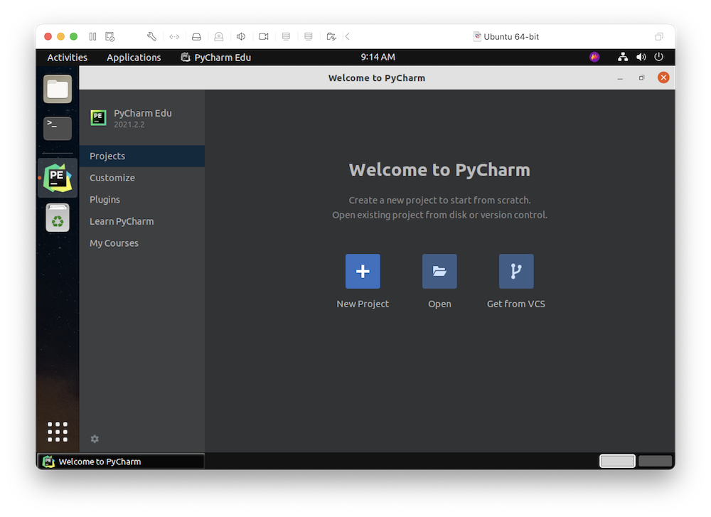
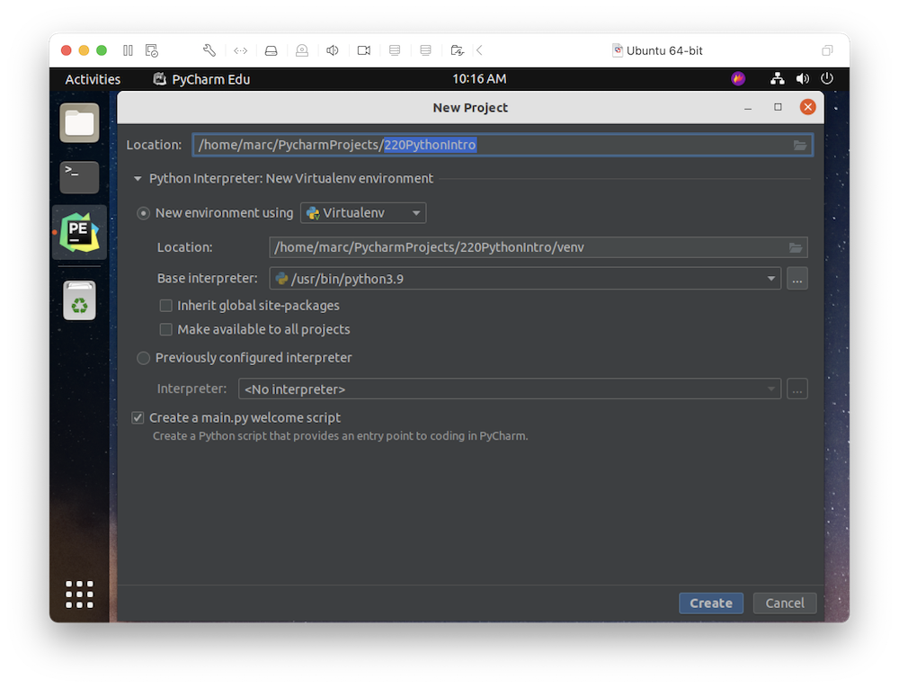
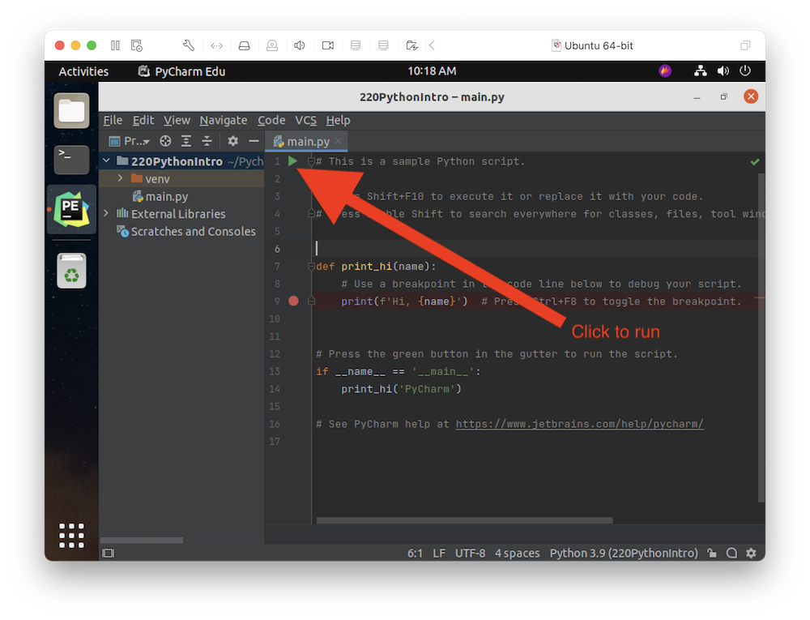
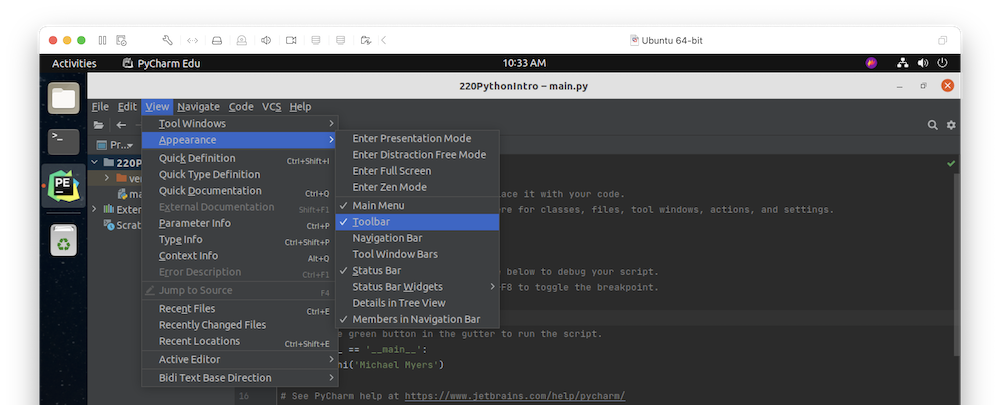
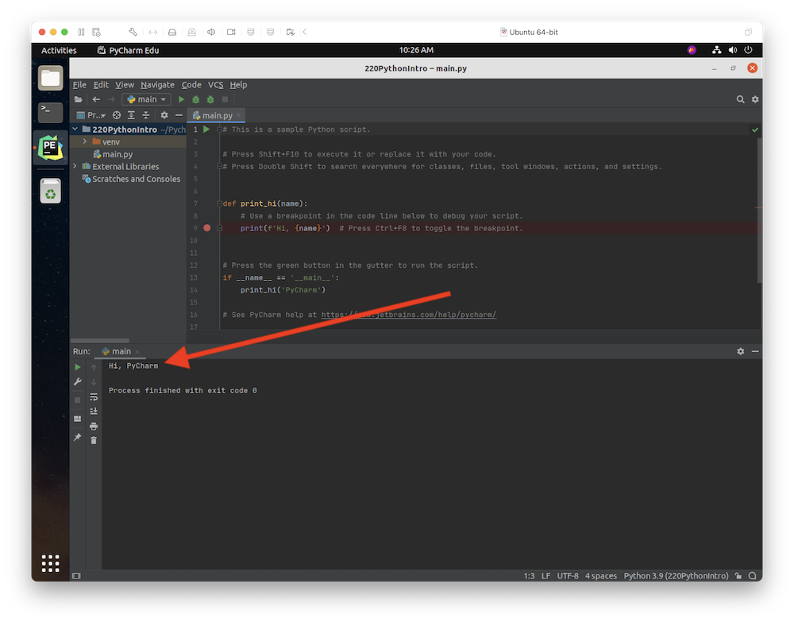
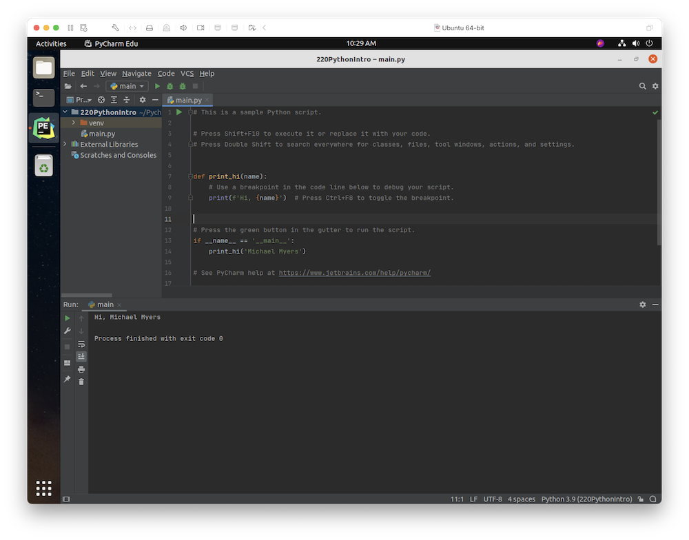

# IST 220 Python Introduction

You don't need to learn Python for this course, but I do think that at least a passing familiarity is a great asset, regardless of your major or career plans.

First, review "[What is Python? Executive Summary](https://www.python.org/doc/essays/blurb/)" from python.org. If you are interested, please review the [linked comparisons](https://www.python.org/doc/essays/comparisons/) between Python and other languages (this is perhaps especially interesting if you've taken a course like IST 140 and are familiar with Java).

Next, once you have a basic familiarity with what Python is, let's install [PyCharm, an integrated development environment](https://www.jetbrains.com/pycharm/), to make things a bit easier to manage. The IDE gives you a graphical application which combines  (this is why it's "integrated") several things which you would otherwise have to do with multiple applications, including the terminal. There are other IDEs aside from PyCharm, but I think this one is the best, and there is a free educational version. Everyone using the same IDE, which reduces variability and makes it much easier for us to provide help if anything goes wrong while you're working on the lab.

Installing PyCharm is simple; just pick from one of the download links below:

* Windows
    * [.exe (Windows) (almost everybody)](https://www.jetbrains.com/pycharm/download/download-thanks.html?platform=windows&code=PCC)
    * [.exe (Windows ARM 64) (only pick this one if you know what you're doing)](https://www.jetbrains.com/pycharm/download/download-thanks.html?platform=windowsARM64&code=PCC)

* Mac
    * [Apple Silicon](https://www.jetbrains.com/pycharm/download/download-thanks.html?platform=macM1&code=PCC)
    * [Intel Mac (pre-2021 Macs)](https://www.jetbrains.com/pycharm/download/download-thanks.html?platform=mac&code=PCC)

Go through the standard terms of service and data sharing screens (choose whichever you wish), and then you'll be at the "Welcome to PyCharm" screen.

Click "New Project." Give your project the name "220PythonIntro", as shown in the screenshot below. Your "Location" field will have your name, instead of "Marc," and the default location will work fine. Leave all of the other buttons and boxes as they are by default, and as shown in the screenshot. Then click "Create."

You should be greeted by a screen like the below:

The file `main.py` contains a series of instructions for the Python interpreter to execute. The typical cycle for development is to make some changes to that file (or other .py Python files), then run the interpreter, see how our code performs, make some more changes, run it again, and so forth. The easiest way to tell PyCharm that we're ready to run the script is to click the green "Play" button next to the line 1 marker. I've indicated this with a huge red arrow in the screenshot. Alternatively, you can select View -> Appearance -> Toolbar, and you'll see a row appear near the top of PyCharm which has a fixed-position Run button.

Once you run the script, you'll see "Hi, PyCharm" appear in the "Run" tool window, as highlighted in the screenshot below. 

Let's modify the script to print your name, instead of PyCharm. Line 14 of the script currently reads:

`    print_hi('PyCharm')`

Replace `'PyCharm'` with `'your_name'`, ex: `'Michael Myers'`. Run it again, and you should see different output:

Congratulations. You are a Python developer, with all the rights, privileges, and responsibilities appertaining thereto.

**Your journey is not complete. Move on to [Exploring Basic Python Syntax](Exploring%20Basic%20Python%20Syntax.md).**
